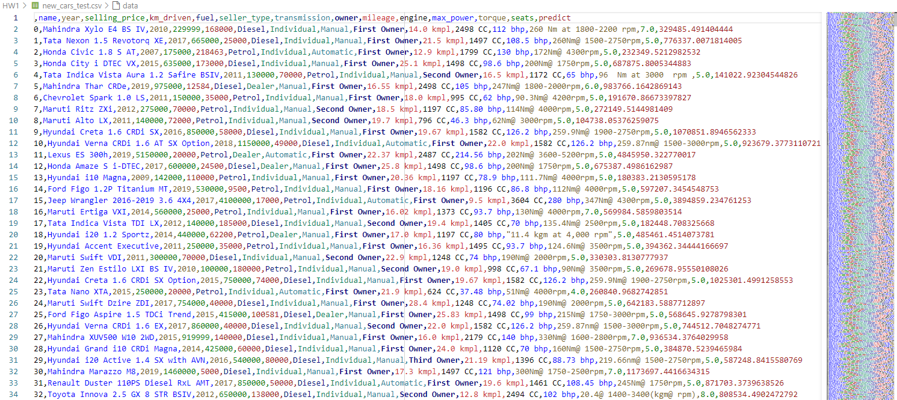

## 1. Анализ
Был произведен анализ датасета, выявлены пропуски, зависимости фичей

## 2. Предобработка данных, выбор модели
Заполнены пропуски в датасете, разделены фичи "максимальное количество оборотов" и "крутящий момент". Причем крутящий момент приведен к общей единице измерения, а максимальное количество оборотов высчитано по формуле для наблюдений, где оно отсутствовало.

Особенно повлияло на результат:
- категоризация названия автомобиля по первым двум словам (марка + модель) Да, мы получили 200+ категорий, но это повысило точность
- выбор оптимальной модели (Ridge с альфа = 0.1)

Итого на тесте получили r2 score почти 0.91

## 3. Создание пайплайна
В пайплайн была добавлена предобработка датасета с помощью кастомного трансформера (custom_transformer.py), а также StandartScaler для числовых фичей и OneHotEncoder для категориальных.
Пайплайн обучен в блокноте и результат сохранен в model.pkl

## 4. Реализация сервиса
Сервис на FastAPI может принимать как одну запись для прогноза, так и целый csv файл (в этом случае сервис возвращает пользователю файл с прогнозом).
Оба эти варианта протестированы с помощью test.py
Результат работы теста представлен на скриншотах

## 5. Не сделано
Не была реализована l0 регуляризация. И не была проведена бонусная фичеинженерия (из-за нехватки времени перед дедлайном по первой части))

Но я считаю, что с помощью предобработки данных достигнуты неплохие результаты.
